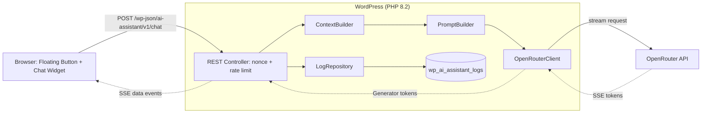

# AI Page Assistant for WordPress

[](https://github.com/zutnik/ai-page-assistant/actions/workflows/ci.yml)

A floating AI chat widget for WordPress sites. Visitors click a button on any page, ask questions in natural language, and receive answers grounded in the actual content of the page they are reading. Powered by OpenRouter for provider-agnostic AI access.


## Why I Built This

I built this plugin as a portfolio project for modern WordPress agency work. It demonstrates custom CMS extension development, database design, REST endpoints and frontend implementation in a real, deployable product that an agency could resell to clients.

Example use case: a law firm or clinic visitor reads a service page, does not understand technical terminology, opens the AI assistant and asks for a simple explanation. The assistant answers using the current page as context and can also search related pages on the site.

## Features

- Floating chat widget on every configured public post type
- Multi-language answers based on visitor/browser language (DE/EN/UK)
- Page-aware context from the current WordPress page
- Related-page lookup using keyword search via `WP_Query`
- Provider-agnostic AI access through OpenRouter
- Auto-selects the current best free OpenRouter model from `https://shir-man.com/api/free-llm/top-models`
- Streaming responses via Server-Sent Events
- IP-based rate limiting with hourly and daily caps
- Admin settings page with model dropdown and GDPR controls
- Conversation logs with search, pagination and CSV export
- GDPR-aware consent banner, retention job and visitor data deletion endpoint
- Local Docker environment with WordPress, MySQL and WP-CLI

## Tech Stack

- Backend: PHP 8.2, strict types, PSR-4 autoloading
- WordPress: custom REST API routes, Settings API, `dbDelta()` migrations
- Database: MySQL via `$wpdb->prepare()`
- Frontend: Vanilla JavaScript, ReadableStream, no jQuery dependency
- Styling: SCSS compiled with Sass
- AI Provider: OpenRouter (Claude, GPT, Gemini, Llama, ...)
- Streaming: Server-Sent Events
- Build: Composer + npm
- Tests: PHPUnit
- Dev environment: Docker Compose

## Architecture



## Quick Start

```bash
git clone https://github.com/zutnik/ai-page-assistant
cd ai-page-assistant
make up
make install-wp
make activate
npm install
npm run build
```

By default Docker binds WordPress to `127.0.0.1:8080`. To expose it only on a private interface such as Tailscale, create a local `.env` file:

```bash
AI_PA_BIND_IP=100.x.y.z
```

Open `http://localhost:8080/wp-admin` and log in with:

- Username: `admin`
- Password: `admin`

Then go to `Settings -> AI Assistant`, add an OpenRouter API key and choose a model.

In local Docker mode the plugin can return a fake streaming response when no API key is configured, which makes the widget easy to demo without spending tokens.

## Configuration

Settings page: `Settings -> AI Assistant`

- OpenRouter API key
- Model dropdown: auto best free model, Claude 3.5 Haiku, Claude 3.5 Sonnet, GPT-4o mini, Gemini Flash, Llama 3.3
- Custom system prompt per site
- Hourly and daily rate limits per IP
- Enabled post types
- Widget color and greeting
- Log storage toggle
- Consent banner toggle
- Retention period
- IP anonymization mode

Conversation logs are available at `Tools -> AI Logs`.

## REST API

- `POST /wp-json/ai-assistant/v1/chat`
  - Requires `X-WP-Nonce`
  - Body: `message`, `page_id`, `visitor_id`, `language`
  - Response: `text/event-stream` with `token`, `done` and `error` events

- `DELETE /wp-json/ai-assistant/v1/data`
  - Requires `X-WP-Nonce`
  - Body: `visitor_id`
  - Deletes stored logs for that visitor id

## Development

```bash
npm run build
vendor/bin/phpunit
make logs
make shell
```

Production zip:

```bash
make zip
```

`.gitattributes` excludes tests, Docker files and development metadata from release archives.

## Roadmap

- Vector embeddings for stronger related-page search
- Conversation history per visitor
- Slack or email notifications for unanswered questions
- WooCommerce product Q&A mode
- OpenRouter model list refresh from API

## License

MIT
